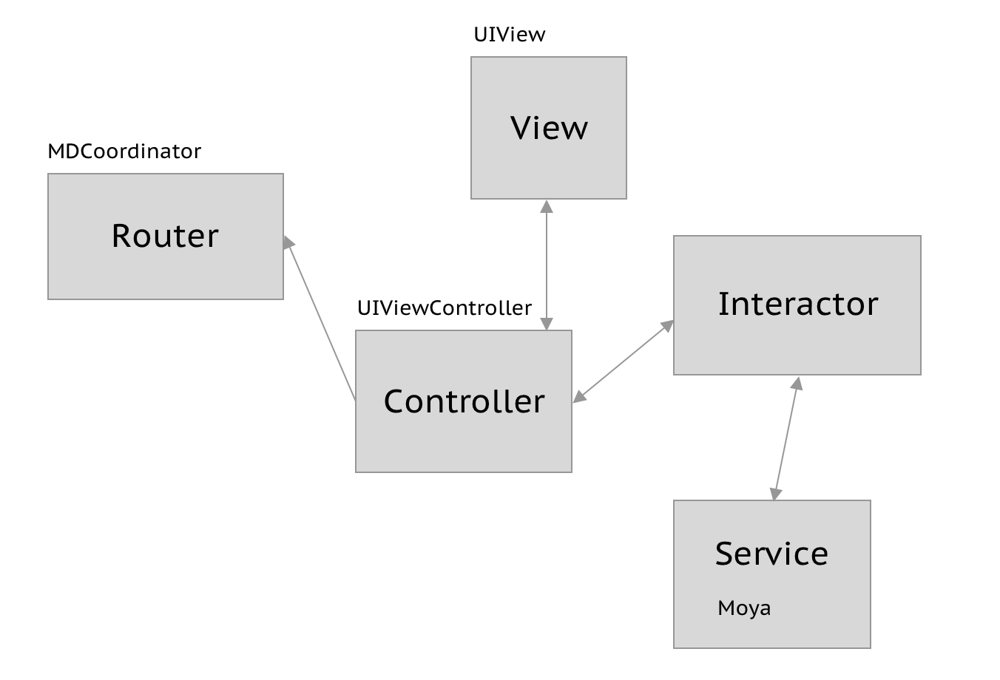

# Mentory app
Supports: iOS 11 and above, swift 5

## Branches:

* master - stable app releases
* Development - development branch, merge your feature branches here

## Dependencies:

The project is using cocoapods for managing external libraries.

Install the pods

```
pod install
```

Generator resources

```
swiftgen config run --config ./mentory/Resources/swiftgen.yml
```
Some modules have architecture like in the scheme:


